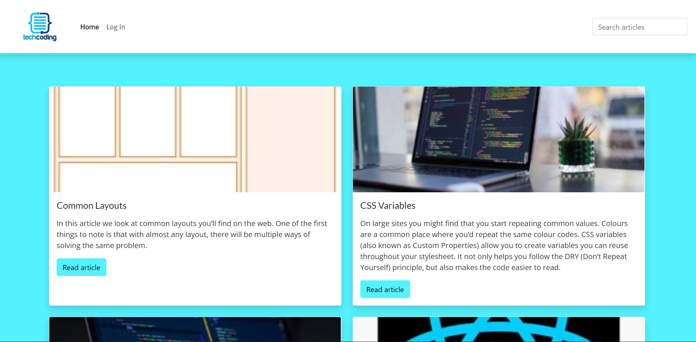

# SemesterProject2

# TechCoding - A Frontend Wiki

This is a wiki-style website for informational articles about frontend development.

## Description

This was our second Semester Project at Noroff, where the goal was to build a website that displays articles about programming on the visitors side, and also has CRUD functionalities in a admin side of the site when logged in. 

Key functionalities when completing the project:

- Displaying all articles created, as well as search-functionality
- Using JWT to log in to the admin dashboard
- Creating a admin dashboard that allows the admin user to create a new article, update articles and delete articles.

## Built With

- [HTML5]
- [CSS]
- [JavaScript]
- [Sass](https://sass-lang.com/)
- [Bootstrap](https://getbootstrap.com)

## Getting Started

Site is deployed at: (https://radiant-capybara-c4023f.netlify.app)

If you would like to view the admin side of the site, please contact me at linnw88@gmail.com and state your purpose, for login credentials.

## Contact

[My LinkedIn page](https://www.linkedin.com/in/linn-wilhelmsen-7999886a/)

